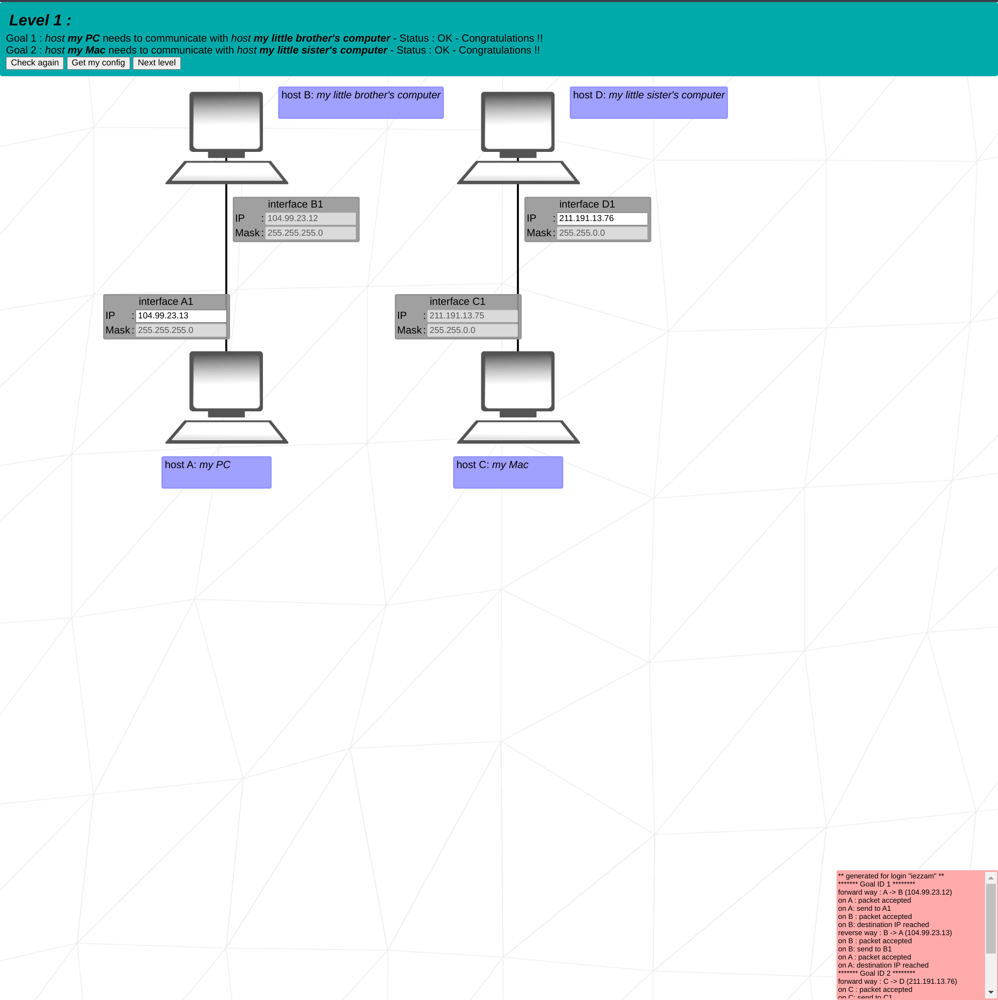
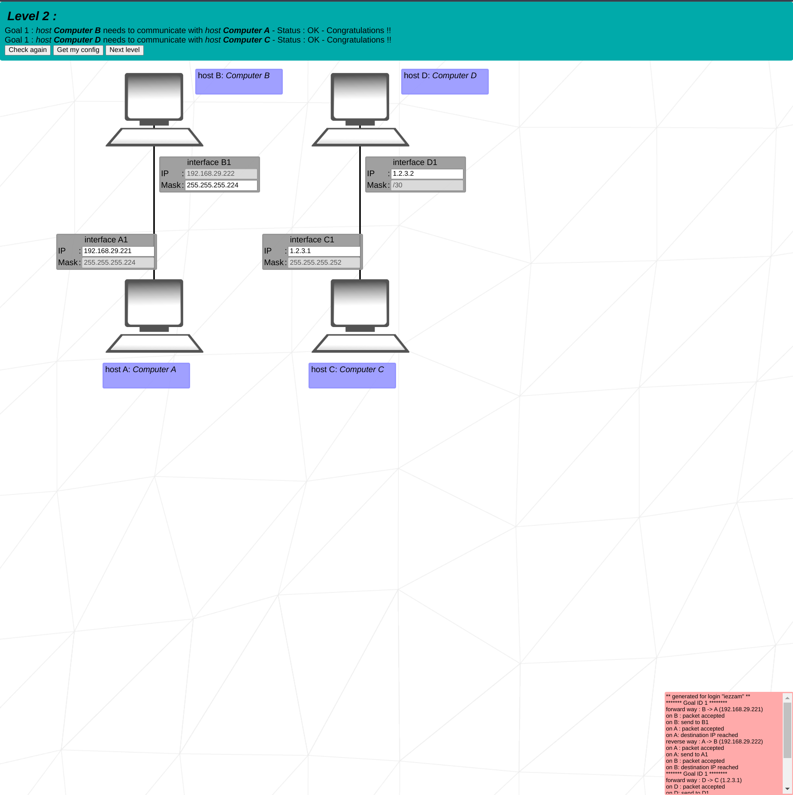
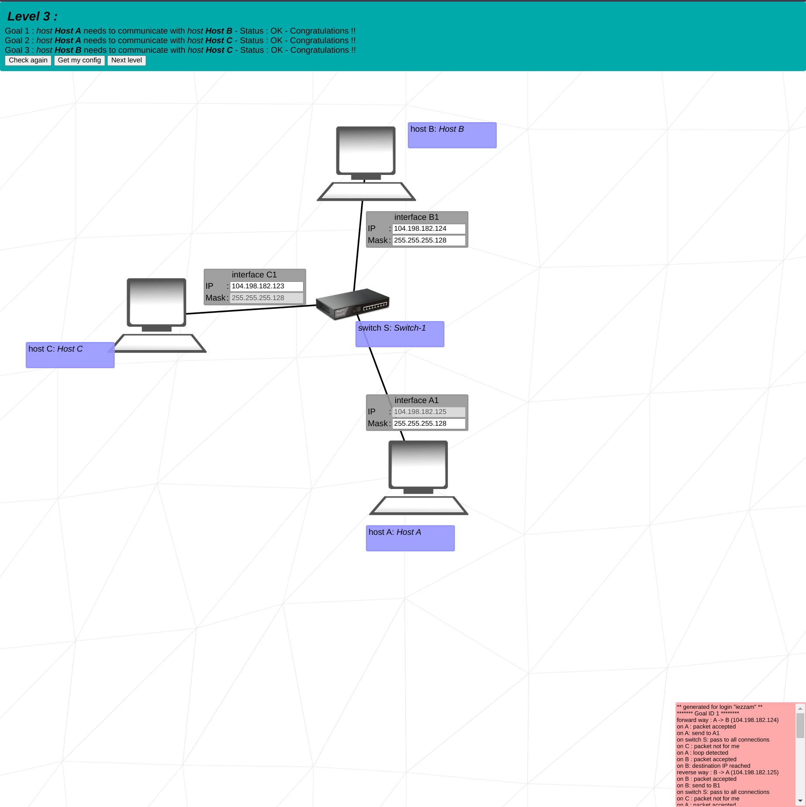
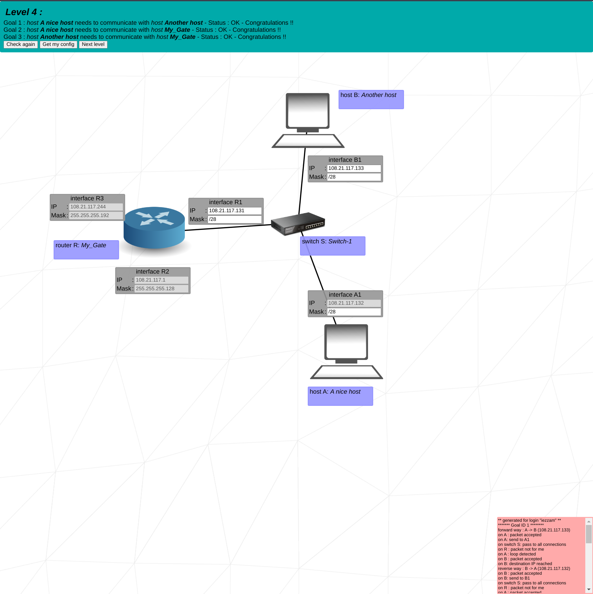
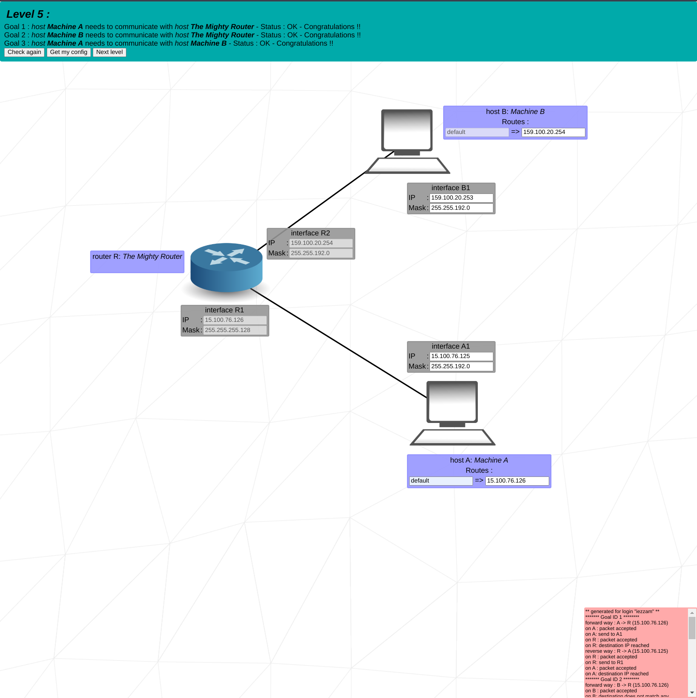
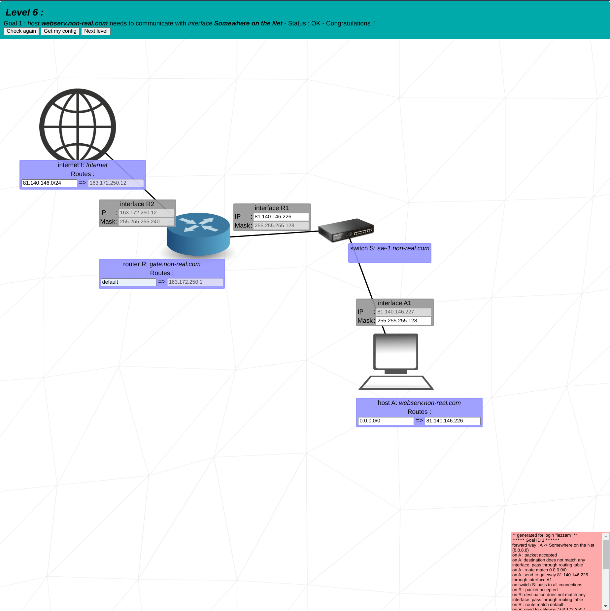
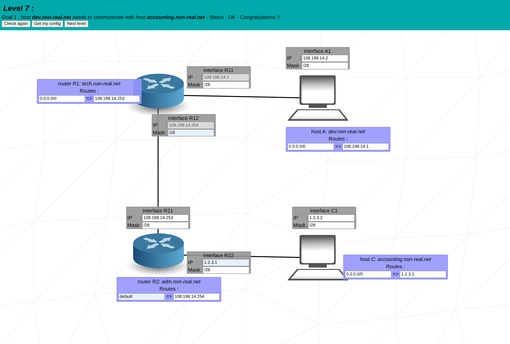
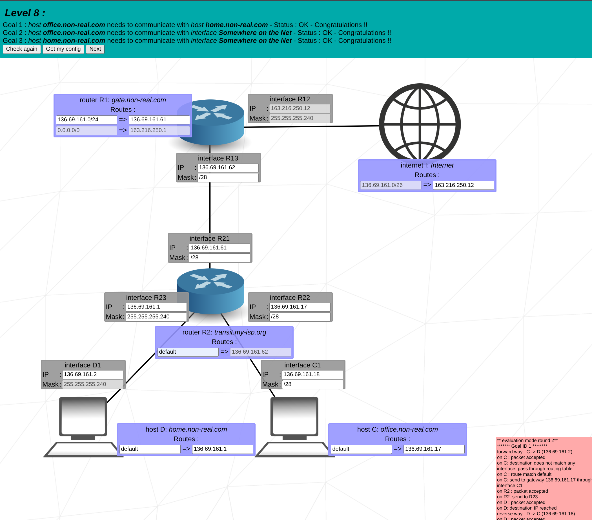
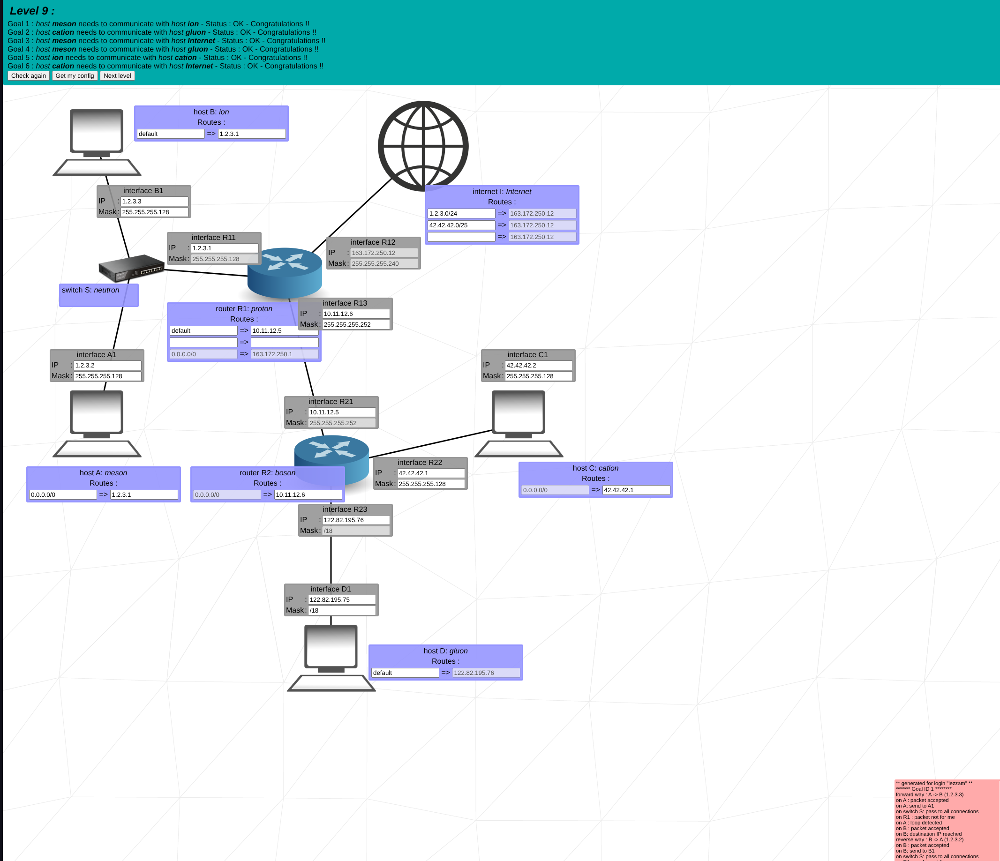
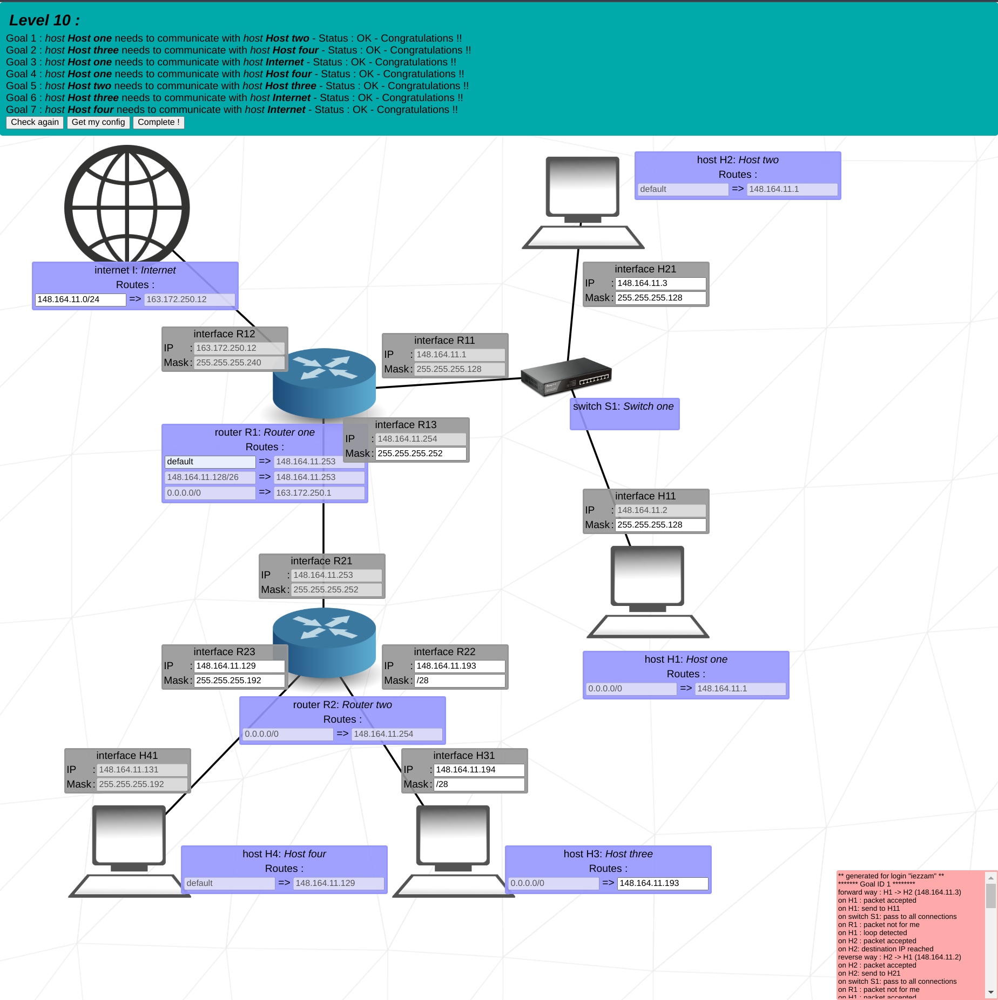

<h1 align="center">1337🇲🇦_Netpractice_42 🐚  Kaneki</h1>
<p align="center">
  <a href="https://github.com/KanekiEzz/1337_Netpractice_42">
    
  </a>
</p>


<p align="center">
	The <strong>net_practice</strong> project is our first networking-related project in the 42 curriculum. It consists of 10 exercises where we configure different small-scale networks to communicate with each other using concepts of TCP/IP addressing. 🚀
</p>


---

## 🔍 First things first...

<h2 id="Network">🌐 What is a Network?</h2>

A **Network** in computing refers to a group of two or more devices that can communicate with each other, enabling the **sending** and **receiving** of data (or *packets*). 🌎


The **Internet** is the largest example of a network, connecting devices worldwide for seamless data sharing. 💻🔗

Networks can be categorized as:
- **Public Networks**: Open to all devices, with minimal control (e.g., the Internet 🌐).
- **Private Networks**: Restricted to specific devices or locations for enhanced security (e.g., Home Networks 🏠🔒).

---

<h2 id="TCP">📡 What is TCP and IP Address?</h2>

To enable seamless communication over networks, we use protocols like **TCP (Transmission Control Protocol)** and **IP (Internet Protocol)**. 🛠️


- **TCP**: Breaks data into packets, sends them, and reassembles them at the destination. 📦
- **IP**: Assigns unique addresses to devices for identification and data routing. 🔢

---

<h2 id="IPv4">🔢 IPv4 and Subnet Masks</h2>

An **IPv4 address** is a 32-bit number divided into four blocks (e.g., `192.168.0.1`). 🧮


We use **Subnet Masks** to divide the address into:
- **Network Address**: Identifies the network.
- **Host Address**: Identifies the individual device. 🖥️

Example:
```
IP Address: 153.172.250.12
Subnet Mask: 255.255.255.0
CIDR: /24
```

Key Insights:
- Reserved IPs: The first and last IPs in a range are reserved for network and broadcast. 🚫
- Subnet masks ensure devices communicate within the same network. 🔗

---

<h2 id="Connecting">🔗 Connecting Multiple Devices</h2>

Devices are connected through:
1. **Public IP (via ISP)**: Links your router to the global Internet. 🌍
2. **Private IP (via Switch)**: Links devices in your local network. 🏠

⚠️ Reserved IP Ranges (e.g., `10.0.0.0 - 10.255.255.255`) must be carefully managed to avoid conflicts.

---

<h3 id="Switch">🔌 Switch</h3>

A **Switch** distributes packets among devices within the same network (LAN). It lacks external communication interfaces. 🖧


---

<h3 id="Router">📶 Router</h3>

A **Router** connects multiple networks, ensuring no IP range overlaps between connected networks. 🌐


---

<h3 id="RouterTable">📋 Routing Table</h3>

A **Routing Table** lists paths for data packets to reach their destinations. Example:
- **Destination**: IP address + CIDR (e.g., `190.3.2.252/30`).
- **Next Hop**: Router address for forwarding packets. 📤

---

<h1 id="NetPractice">🎮 Net Practice</h1>

<details>
  <summary>🧩 Level 1</summary>
  <p>💡 Set IPs within the same subnet range for devices to communicate.</p>
  
</details>

<details>
  <summary>🧩 Level 2</summary>
  <p>💡 Ensure all devices in a network share the same mask and avoid reserved IPs.</p>
  
</details>

<details>
  <summary>🧩 Level 3</summary>
  <p>💡 Introduce switches for multi-device communication within the same network.</p>
  
</details>

<details>
  <summary>🧩 Level 4</summary>
  <p>💡 Use routers to connect multiple networks. Avoid overlapping IP ranges.</p>
  
</details>

<details>
  <summary>🧩 Level 5</summary>
  <p>💡 Configure routing tables to ensure proper packet forwarding between networks.</p>
  
</details>

<details>
  <summary>🧩 Level 6</summary>
  <p>💡 Connect devices to the Internet using routing tables for seamless communication.</p>
  
</details>

<details>
  <summary>🧩 Level 7</summary>
  <p>💡 Manage overlapping IP ranges across multiple networks.</p>
  
</details>

<details>
  <summary>🧩 Level 8</summary>
  <p>💡 Establish Internet communication for multiple devices via routing tables.</p>
  
</details>

<details>
  <summary>🧩 Level 9</summary>
  <p>💡 Combine all previous concepts to set up a complex network structure.</p>
  
</details>

<details>
  <summary>🧩 Level 10</summary>
  <p>💡 Configure networks without overlapping subnets for Internet routing.</p>
  
</details>

---

<h2 id="KeyConcepts">📖 Key Networking Concepts</h2>

### 1️⃣ **Public vs Private IP**
- **Public IP**: Visible on the Internet, assigned by ISPs. 🌍
- **Private IP**: Used within local networks. 🏠


---

### 2️⃣ **NAT (Network Address Translation)**
- **Purpose**: Translates private IPs to public IPs for Internet communication. 🔄
- **Example**: Your home router uses NAT to allow all devices to share one public IP.


---

### 3️⃣ **HTTP (Hypertext Transfer Protocol)**
- **Purpose**: Protocol for transferring web pages and data over the Internet. 🌐
- **Example**: Browsing websites like `https://github.com`.


---

<h1 id="OSIModel">📖 Understanding the OSI Model</h1>

The **OSI (Open Systems Interconnection) Model** is a conceptual framework that standardizes the functions of a communication system into **7 distinct layers**. Each layer performs a specific task and communicates with the layers directly above and below it. Understanding these layers helps in troubleshooting, designing, and improving network communications. 🚀

---

## OSI Model Diagram 🖼️


---

## 🔎 OSI Model Layers Explained

### 1️⃣ **Physical Layer**
- 💡 **Purpose:** Transmits raw binary data (bits) over physical mediums like cables, radio waves, or fiber optics.
- 📍 **Key Components:** 
  - Cables (Ethernet, coaxial, fiber optics)
  - Connectors
  - Network Interface Cards (NIC)
- 🛠️ **Example:** Converting electrical signals into light signals in fiber optics.

---

### 2️⃣ **Data Link Layer**
- 💡 **Purpose:** Ensures reliable data transfer between devices in the same network (local communication).
- 📍 **Key Components:**
  - MAC (Media Access Control) addresses
  - Switches
- 🛠️ **Example:** Error detection and correction using CRC (Cyclic Redundancy Check).

---

### 3️⃣ **Network Layer**
- 💡 **Purpose:** Manages routing and forwarding of data between different networks.
- 📍 **Key Components:**
  - IP (Internet Protocol) addresses
  - Routers
- 🛠️ **Example:** Finding the shortest path for data using routing protocols like OSPF or BGP.

---

### 4️⃣ **Transport Layer**
- 💡 **Purpose:** Ensures complete data transfer with error checking and flow control.
- 📍 **Key Components:**
  - TCP (Transmission Control Protocol)
  - UDP (User Datagram Protocol)
- 🛠️ **Example:** Resending lost packets to ensure all data is received (reliable communication).

---

### 5️⃣ **Session Layer**
- 💡 **Purpose:** Establishes, manages, and terminates communication sessions between devices.
- 📍 **Key Components:**
  - APIs (Application Programming Interfaces)
  - Sockets
- 🛠️ **Example:** Maintaining a session for a video call or file transfer.

---

### 6️⃣ **Presentation Layer**
- 💡 **Purpose:** Translates data between the application layer and the rest of the OSI model. Handles encryption and compression.
- 📍 **Key Components:**
  - Data formats (JPEG, MP3, MP4)
  - SSL/TLS for encryption
- 🛠️ **Example:** Converting an image file into a format that can be displayed on a web browser.

---

### 7️⃣ **Application Layer**
- 💡 **Purpose:** Provides user interfaces and communication services to applications.
- 📍 **Key Components:**
  - Protocols like HTTP, FTP, SMTP
  - Web browsers, email clients
- 🛠️ **Example:** Accessing a website using a browser via HTTP.

---

🚀 **Happy Networking!** 🌐✨
